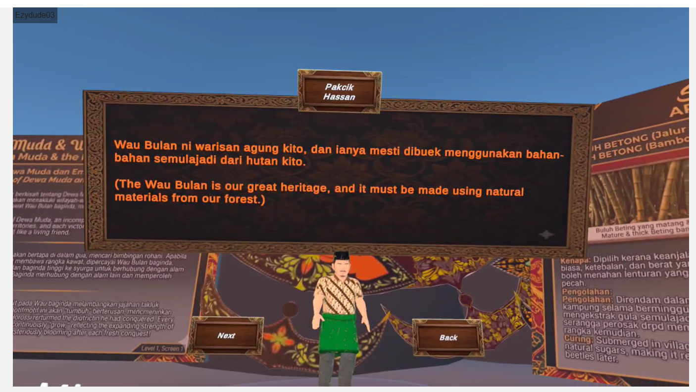
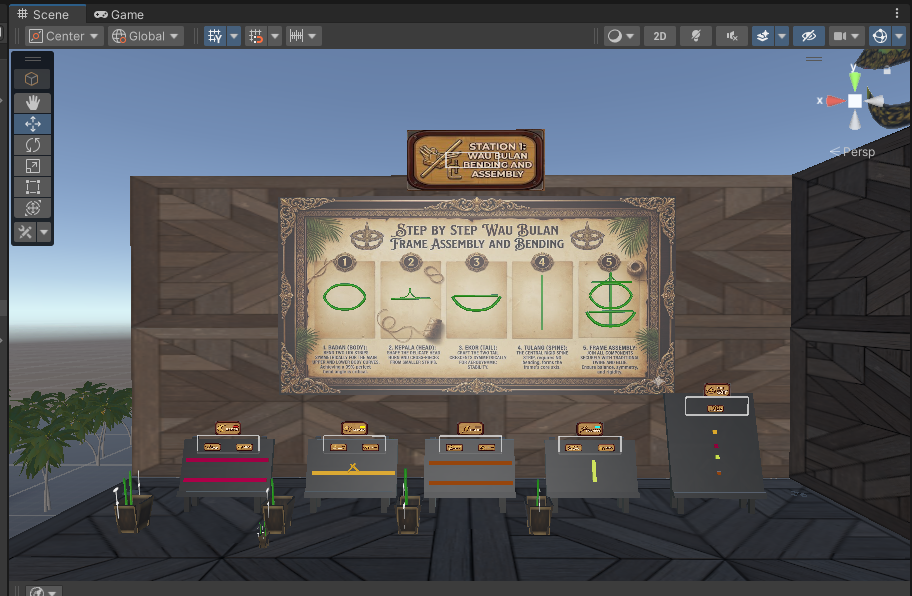
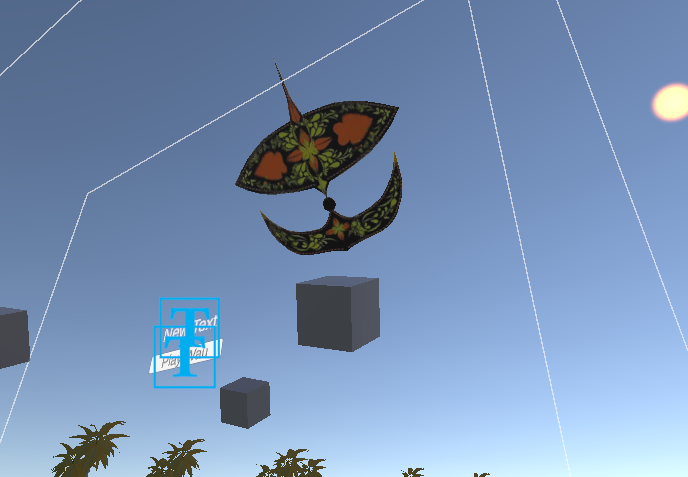
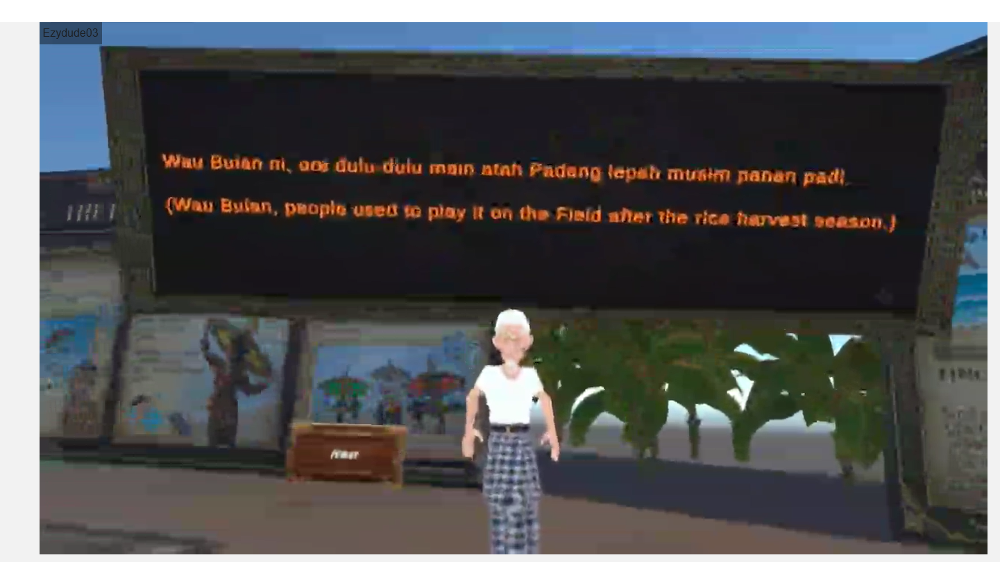
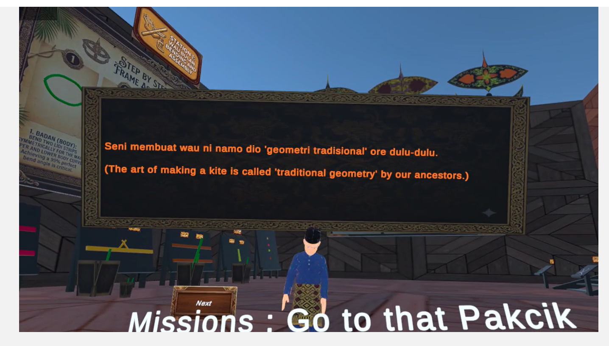
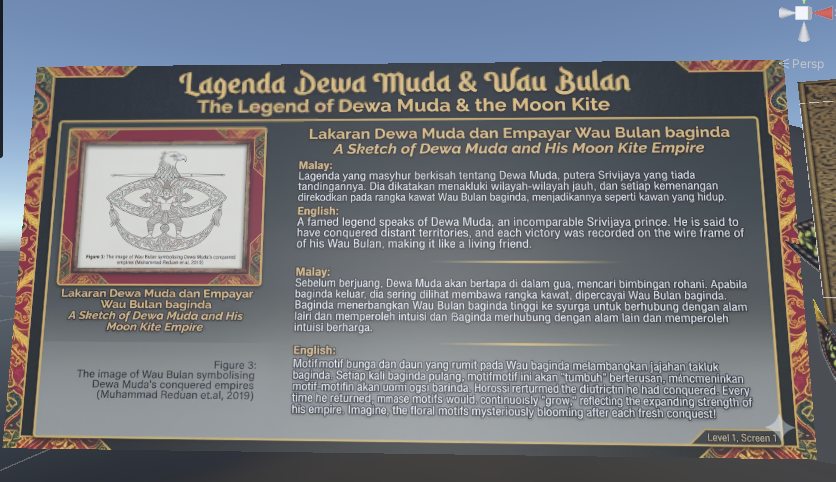
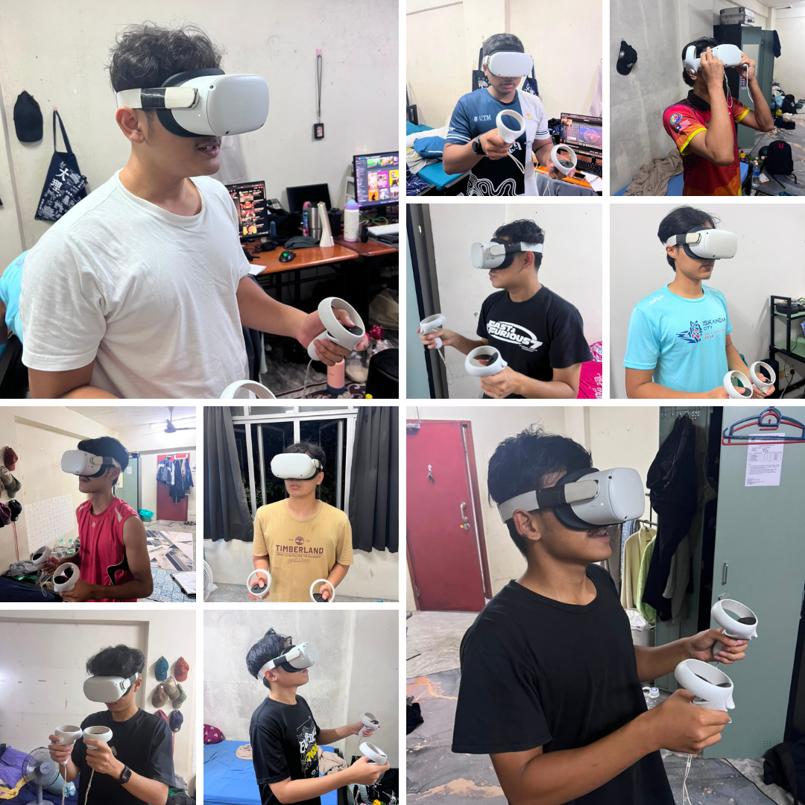

# 🪁 Interactive Game-Based Learning of Wau Bulan with NPCs in Virtual Reality (VR)

**Final Year Project (PSM 2)**  
**Student:** Muhammad Farezy Bin Ab Rahman | **ID:** A22EC0209  
**Institution:** Universiti Teknologi Malaysia  
**Academic Session:** 2024/2025  
**Completed:** 25 May 2026  
**Status:** ✅ **Completed**

---

## 📋 Project Overview

This VR educational game preserves and promotes the traditional Malaysian art of **Wau Bulan** (iconic crescent-shaped kite) through immersive, interactive gameplay. Players learn the complete cultural process — from material gathering to crafting and flying — guided by friendly NPCs in a virtual Malaysian *kampung* (village).

The project serves as both an educational tool and cultural preservation initiative, combining traditional Malaysian heritage with VR technology on the Meta Quest 2 platform.

---

## 📸 Screenshots

| NPC Design (Pakcik Hassan) | Crafting Station | Wau Bulan Flying |
|:---:|:---:|:---:|
|  |  |  |

| NPC Design (Tok Ngah) | NPC Design (Pakcik Azeimi) | Knowledge Sharing Screen |
|:---:|:---:|:---:|
|  |  |  |

### User Testing Sessions



---

## 🎮 Core Gameplay (3 Levels)

### **Level 1: Exploration & Collection** 🏘️ — **Complete**
- **Objective:** Explore the traditional *kampung* environment and gather materials
- **Collectible Materials:**
  - **Buluh** (Bamboo strips) — Found scattered around village structures
  - **Kertas** (Decorative paper) — Located in specific village locations
  - **Tali** (String/twine) — Distributed throughout the environment
- **NPC Interactions:** (3 Main Characters)
  - **Tok Ngah** — Cultural guide providing heritage context
  - **Pakcik Hassan** — Material collection guidance
  - **Pakcik Azeimi** — Craft/flying preparation advice
- **Mechanics:**
  - XR Grab Interactable system for item pickup
  - Real-time inventory tracking (CollectibleItem.cs, InventoryManager system)
  - Checkpoint validation before Level 2 progression
  - Dialogue triggers and narrative progression
- **Final Status:**
  - Environment design: ✅ Complete
  - Item collection system: ✅ Complete
  - NPC dialogue system: ✅ Complete
  - Inventory UI: ✅ Complete
  - Checkpoint logic: ✅ Complete

### **Level 2: Crafting Station** 🛠️ — **Complete**
- **Objective:** Step-by-step Wau Bulan assembly at traditional workbench
- **Mechanics:**
  - Snap zones for precision assembly of kite parts
  - Step-by-step guided assembly sequence
  - Visual feedback for valid/invalid placement
  - Customization options for kite design (colors, materials)
- **Final Status:**
  - Crafting station scene layout: ✅ Complete
  - Snap zone implementation: ✅ Complete
  - Assembly progression logic: ✅ Complete
  - Customization system: ✅ Complete
- **Dependencies:** Finalized Wau Bulan 3D model (✅ Complete)

### **Level 3: Flight & Mastery** 🪁 — **Complete**
- **Objective:** Fly the crafted Wau Bulan across 3 scenic zones with varying difficulty
- **Flight Zones:**
  - **Padang** (Easiest) — Open field with light winds
  - **Sawah Padi** (Medium) — Rice paddy with moderate winds
  - **Pantai** (Hardest) — Beach with strong coastal winds
- **Mechanics:**
  - Physics-based kite flight simulation
  - Wind system with direction/force/variation
  - Player controls (pull/release/steer interactions)
  - Dual-hand string tension interaction for immersion
  - Success/failure conditions (target height, duration, balance)
- **Final Status:**
  - Flight behavior research: ✅ Complete
  - Prototype code refactoring: ✅ Complete
  - Wind system logic: ✅ Complete
  - Rigidbody integration: ✅ Complete
  - Player controls: ✅ Complete
  - Physics tuning: ✅ Complete

---

## 📊 Development Progress by Component

```
Phase 1: Core Systems & Level 1        ██████████ 100% - Complete
Phase 2: Level 2 Crafting             ██████████ 100% - Complete
Phase 3: Level 3 Flying               ██████████ 100% - Complete
Phase 4: Integration & Optimization   ██████████ 100% - Complete
Phase 5: Polish & Testing             ██████████ 100% - Complete
```

### **Key Metrics**

| Metric | Target | Result |
|--------|--------|--------|
| **FPS Target** | 60+ FPS on Quest 2 | ✅ Achieved |
| **Build Size** | < 2 GB | ✅ Within target |
| **Playable Content** | 3 full levels | ✅ All 3 levels complete |
| **NPCs** | 3 unique characters | ✅ 3 dialogues implemented |
| **Scenes** | 7 main scenes | ✅ 7 scenes complete |

---

## 🛠️ Technologies & Tools

| Category | Technology |
|----------|-----------|
| **Game Engine** | Unity 2022 LTS |
| **VR Framework** | Meta All-in-One SDK |
| **Interaction** | XR Interaction Toolkit (XRI) v2.x |
| **Programming** | C# |
| **3D Modeling** | Blender 3.x |
| **UI** | TextMeshPro + Unity Canvas UI |
| **Target Platform** | Meta Quest 2 (Standalone VR) |
| **Development VCS** | Git + GitHub |

---

## 📁 Project Structure

```
Wau-Bulan-Vr/
├── Wau Bulan Vr/                    # Main Unity Project
│   ├── Assets/
│   │   ├── Scripts/                 # C# Gameplay Systems
│   │   │   ├── BambooBender.cs           # Bamboo bending mechanics
│   │   │   ├── BoxWind.cs                # Wind zone logic
│   │   │   ├── Items_Collect.cs          # Item pickup system
│   │   │   ├── NPC_Text.cs               # NPC dialogue management
│   │   │   ├── JoystickObjectMover.cs    # Player input handling
│   │   │   ├── SceneFader.cs             # Scene transition effects
│   │   │   ├── Score.cs                  # Scoring system
│   │   │   ├── TextRotateCam.cs          # UI orientation lock
│   │   │   ├── VRSliderPhysical.cs       # VR-specific UI
│   │   │   └── InventoryManager.cs       # Inventory tracking (core system)
│   │   │
│   │   ├── Scenes/                  # Level Scenes
│   │   │   ├── BasicScene.unity          # VR setup test scene
│   │   │   ├── Level 1.unity             # Main Level 1 (exploration)
│   │   │   ├── Level 2 (Level Design).unity  # Level 2 design iteration
│   │   │   ├── Level_2.unity             # Level 2 crafting
│   │   │   ├── Level 3 - Mechanic.unity  # Level 3 flight mechanics
│   │   │   ├── Credit.unity              # Credits/end scene
│   │   │   └── SampleScene.unity         # Utility test scene
│   │   │
│   │   ├── Models/                  # 3D Models (FBX)
│   │   │   ├── FBX Files/               # Wau Bulan, environment assets
│   │   │   └── Wau_Bulan_Model.fbx
│   │   │
│   │   ├── Materials/               # PBR Materials
│   │   │   └── (Material definitions for kite and environment)
│   │   │
│   │   ├── Prefabs/                 # Reusable Game Objects
│   │   │   └── (NPC, collectible items, UI elements)
│   │   │
│   │   ├── Animations/              # Animation files
│   │   │
│   │   ├── Resources/               # Dialogue data, config files
│   │   │
│   │   ├── Music/                   # Audio tracks & ambience
│   │   │
│   │   ├── Oculus/                  # Meta SDK Integration
│   │   │
│   │   ├── XR/                      # XR-specific assets
│   │   │
│   │   ├── XRI/                     # XR Interaction Toolkit assets
│   │   │
│   │   ├── TextMesh Pro/            # TextMeshPro resources
│   │   │
│   │   ├── Settings/                # Project settings
│   │   │
│   │   └── VRTemplateAssets/        # VR template defaults
│   │
│   ├── Packages/                    # Unity packages
│   │   ├── manifest.json            # Package dependencies
│   │   └── (Meta SDK, XRI, TextMeshPro)
│   │
│   ├── ProjectSettings/             # Unity configuration
│   │
│   └── Wau Bulan Vr.sln             # Visual Studio solution
│
├── README.md                        # This documentation
├── checklist_timeline_psm2.csv      # Development timeline & tasks
└── .gitignore                       # Git configuration
```

---

## 📝 Key Features Implemented

### **Educational Value** 📚
- Authentic representation of Wau Bulan craftsmanship
- Step-by-step learning progression (gather → craft → fly)
- Cultural immersion through interactive gameplay with NPCs
- Historical and practical context via dialogue system

### **VR/UX Excellence** 🎮
- Intuitive hand-based interaction via XRI
- Natural movement and locomotion
- Comfortable gameplay optimized for Meta Quest 2
- Real-time inventory management system

### **Technical Architecture** 🔧
- Modular C# scripts (item system, inventory, NPC interactions)
- Extensible component-based design
- Physics-based interactions
- Save/load progression system
- Wind simulation for realistic flight

---

## 🏃 Getting Started

### **Prerequisites**
- Unity 2021 LTS (or later)
- Meta All-in-One SDK
- XR Interaction Toolkit package (v2.x)
- Meta Quest 2 device (for VR testing)
- Visual Studio or compatible C# IDE

### **Setup Instructions**

1. **Clone the repository:**
   ```bash
   git clone https://github.com/Farezyrahman/Wau-Bulan-Vr.git
   cd Wau-Bulan-Vr
   ```

2. **Switch to Unity branch:**
   ```bash
   git checkout Unity
   ```

3. **Open in Unity Hub:**
   - Add the `Wau Bulan Vr` folder as a new project
   - Wait for packages to resolve (~5-10 minutes)

4. **Install Required Packages:**
   - Meta All-in-One SDK (via Package Manager)
   - XR Interaction Toolkit (should auto-import)

5. **Open a scene:**
   - Start with `Assets/Scenes/BasicScene.unity` for VR setup verification
   - Or open `Assets/Scenes/Level 1.unity` for gameplay

6. **Build & Deploy to Quest 2:**
   - File → Build Settings
   - Select Android platform
   - Build and deploy to connected Meta Quest 2

---

## 🧪 Testing Checklist

### **Level 1 - Exploration**
- [x] Item pickup mechanic works for all 3 materials
- [x] Inventory UI displays correct item counts
- [x] NPC interactions trigger dialogue properly
- [x] Checkpoint validation prevents progression with missing items
- [x] Scene transition to Level 2 is smooth

### **Level 2 - Crafting**
- [x] Crafting station scene loads correctly
- [x] Snap zones detect correct assembly order
- [x] Visual feedback shows valid/invalid placements
- [x] Customization options function
- [x] Scene transition to Level 3 works

### **Level 3 - Flying**
- [x] Kite physics responds to wind
- [x] Player controls handle kite effectively
- [x] 3 difficulty zones present different challenges
- [x] Success/failure conditions trigger correctly
- [x] End credits scene displays

### **Cross-Level**
- [x] Save/load preserves progress between sessions
- [x] 60+ FPS maintained on Meta Quest 2
- [x] No memory leaks or crashes
- [x] Audio plays without issues
- [x] All VR interactions feel natural

---

## 📅 PSM-2 Timeline & Milestones

| Milestone | Target Date | Status |
|-----------|------------|--------|
| **MVP Scope Finalized** | 16/03/2026 | ✅ Complete |
| **VR Core Setup** | 21/03/2026 | ✅ Complete |
| **Level 1 Environment** | 25/03/2026 | ✅ Complete |
| **NPC System & Dialogue** | 01/04/2026 | ✅ Complete |
| **Inventory System** | 04/04/2026 | ✅ Complete |
| **Level 1 Playtest** | 13/04/2026 | ✅ Complete |
| **Level 2 Layout** | 14/04/2026 | ✅ Complete |
| **Level 3 Mechanics** | 18/04/2026 | ✅ Complete |
| **Level 2 Crafting Complete** | 26/04/2026 | ✅ Complete |
| **Level 3 Flight Complete** | 04/05/2026 | ✅ Complete |
| **All 3 Levels Integrated** | 08/05/2026 | ✅ Complete |
| **Performance Optimization** | 16/05/2026 | ✅ Complete |
| **User Testing** | 18/05/2026 | ✅ Complete |
| **Final Polish & Fixes** | 21/05/2026 | ✅ Complete |
| **Build Preparation** | 22/05/2026 | ✅ Complete |
| **Final QA & Submission** | 25/05/2026 | ✅ Complete |

---

## 🛠️ Technologies & Tools Used Throughout Development

- **Meta Quest Developer:** https://developer.meta.com/
- **XR Interaction Toolkit Docs:** https://docs.unity3d.com/Packages/com.unity.xr.interaction.toolkit/latest/
- **Unity 2021 LTS Docs:** https://docs.unity3d.com/2021LTS/Documentation/
- **Wau Bulan Cultural References:** Traditional Malaysian Heritage Research
- **VR Comfort Guidelines:** Meta Best Practices & Industry Standards

---

## 📜 License

This project was developed as part of the Final Year Project (PSM 2) at Universiti Teknologi Malaysia (2024/2025).

---

## 🙏 Acknowledgments

- **Universiti Teknologi Malaysia** — Academic supervision and facilities
- **Meta/Oculus** — VR development platforms and tools
- **Open-source Community** — XR Interaction Toolkit, TextMeshPro, and supporting libraries
- **Malaysian Cultural Heritage Community** — Wau Bulan inspiration and reference materials

---

## 👤 Author & Contact

**Muhammad Farezy Bin Ab Rahman**  
**Student ID:** A22EC0209  
**Universiti Teknologi Malaysia**  
**Project Repository:** [Wau-Bulan-Vr](https://github.com/Farezyrahman/Wau-Bulan-Vr)

---

**Last Updated:** 25 May 2026  
**Repository Status:** ✅ Completed
